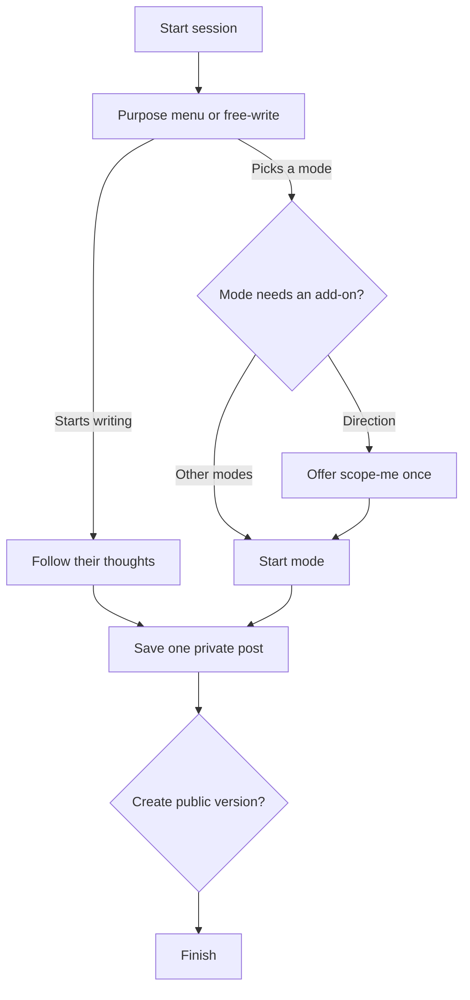

# Morning Journal: Purpose and Session Modes

## Purpose

Morning Journal is a conversational writing tool, not a single fixed
questionnaire. Its purpose is to help people use journaling for the kind of
thinking they need at that moment.

The skill—and a possible future app—should facilitate journaling that can:

- enhance clarity by putting diffuse thoughts into words;
- process emotions without diagnosing or forcing a positive conclusion;
- identify goals, define an MVP, and turn intention into observable outputs;
- create space to think privately without optimizing for productivity;
- notice gratitude, strengths, support, and what is already working;
- track habits, recurring patterns, progress, and changes over time;
- learn from an experience, outcome, or decision;
- explore ideas, questions, identity, values, and creative possibilities;
- preserve memories and document a period of life;
- develop a thought into something another person can read;
- prepare for a conversation or understand another person's perspective.

These purposes can overlap. The first turn offers a purpose menu (button-style
choices when the host supports them). Modules are added only when useful for that
purpose. If the writer starts reflecting immediately, the skill follows their
words and skips remaining setup.

## Session architecture

The skill asks one question at a time. Setup is minimal by default.

## Primary modes

### Open writing / think by myself

**Purpose:** Clear mental noise, follow an emerging thought, or write without
having to turn the session into a plan.

**Default shape:** Free-write, receive a brief reflection, then answer 1–3
follow-ups chosen from what emerged.

**Estimated reflective questions:** 2–4, plus the free-writing turn.

### Process emotions or an experience

**Purpose:** Name what happened and what is felt, distinguish facts from
interpretation, gain perspective, and identify what remains unresolved.

**Default shape:** Feeling → event or concern → meaning → controllability or
perspective → what would help.

**Estimated reflective questions:** 5–7.

This mode supports reflection; it is not therapy or medical care. Repeated writing
that becomes rumination should not be treated as progress merely because it is
longer.

### Find direction and get going

**Purpose:** Move from ambiguity or overwhelm to a chosen direction and a small
first action.

**Default shape:** What matters → available options → decision criterion → chosen
direction → first move → likely obstacle.

**Estimated reflective questions:** 5–7.

The user may be offered `/scope-me` **only in this mode** (or when they ask for
planning). If selected, `/scope-me` defines an observable MVP, time budget,
session outputs, first move, and obstacle reset. Answers already given are reused.

### Gratitude and noticing what works

**Purpose:** Attend to specific sources of support, progress, pleasure, meaning,
or effective behavior—and understand why they mattered.

**Default shape:** Notice → specificity → contribution or meaning → what to carry
forward.

**Estimated reflective questions:** 3–5.

Gratitude is optional and must not be used to bypass difficulty. It can be placed
at the beginning to orient attention or at the end to close the session.

### Track habits, patterns, and progress

**Purpose:** Record observable behavior or progress, notice conditions and
patterns, and decide whether to continue, adjust, or investigate.

**Default shape:** What to track → evidence since the last check-in → conditions
or triggers → interpretation → next experiment.

**Estimated reflective questions:** 4–6.

Avoid presenting a single observation as a stable pattern. The journal should
distinguish measurement from interpretation.

### Learn, review, or improve a decision

**Purpose:** Learn from an event, project, result, or decision without confusing
outcome quality with decision quality.

**Default shape:** What happened → what was expected → what differed → lesson →
what to repeat or change.

**Estimated reflective questions:** 4–6.

### Explore or create

**Purpose:** Generate ideas, examine an unanswered question, develop creative
material, or discover what the writer thinks.

**Default shape:** Question or seed → possibilities → most alive thread →
development → next experiment.

**Estimated reflective questions:** 4–6.

### Write to share

**Purpose:** Develop a private thought into a standalone piece for a particular
reader or audience.

**Default shape:** Core idea → intended reader → desired effect → necessary
context → boundaries → draft emphasis.

**Estimated reflective questions:** 5–7.

The private session post is still saved first. The separate `_public.md` version
is edited for an outside reader and must be reviewed before sharing.

### Remember or document

**Purpose:** Preserve a meaningful day, relationship, transition, place, or
experience in enough detail to revisit later.

**Default shape:** What happened → sensory or concrete detail → people and context
→ why it matters → what should not be forgotten.

**Estimated reflective questions:** 4–6.

### Custom or mixed

**Purpose:** Combine modes when none fits cleanly.

The skill asks what the session should accomplish, selects the smallest useful
combination, then states a fresh question estimate before proceeding.

## Optional modules

Modules are **not** asked every session. Defaults:

1. **`/scope-me`:** Offer only for “find direction and get going,” or when the
   user asks for an MVP / time budget. If installed, invoke it in the same
   conversation. If unavailable, offer the built-in lightweight scope route.
2. **Gratitude:** Available as a primary mode, or add mid-session if requested.
   Do not ask every session “beginning / end / not today?” after reflective
   writing has begun.
3. **Habits and progress:** Available as a primary mode, or add mid-session if
   requested. Do not force a tracking checkbox onto unrelated reflections.

Optional modules add questions only when selected:

- Gratitude: approximately 2–3.
- Habit/progress tracking: approximately 2–4.
- Full `/scope-me`: up to 9, usually fewer because existing answers are reused.
- Lightweight scope fallback: approximately 4.

## Early writing override

If the user picks a reflective purpose and begins writing, or dumps thoughts
instead of answering a menu, the skill:

1. Infers the closest mode.
2. Skips remaining intake questions.
3. Reflects themes and asks one grounded follow-up.

Setup exists to help them begin, not to delay them.

## Question map and pacing

Once the mode is clear, the skill may state a lightweight map:

> **Session:** [mode] · about [N–M] follow-ups · say finish when you want the post

The estimate is a promise about shape, not a quota. Prefer follow-ups grounded in
the user's latest words over checklist traversal of a question bank. Skip what
is already answered, finish early when enough material exists, and update the
estimate if the route changes.

## Output behavior

- One completed session creates one private timestamped post.
- A later session on the same day creates another post rather than appending.
- A user can combine a day's source posts into a separate synthesis.
- After each private post or combined synthesis, the skill offers a separate
  public version edited for context, readability, and privacy.
- Source posts remain unchanged. The skill never publishes automatically.
- Sections in the final post adapt to the chosen mode; a processing session does
  not need an MVP, and a gratitude session does not need a problem reframe.

## Design principles

- **Purpose before prompts:** Offer a purpose menu first—or follow free-writing
  immediately if the user starts writing.
- **Follow the writing:** Live material beats remaining intake questions.
- **One question at a time:** Conversation should feel responsive, not like form
  completion.
- **Conditional modules:** Scope, gratitude, and tracking only when the mode or
  user asks for them.
- **Minimum sufficient structure:** Use only the modes and modules that serve the
  session.
- **Private first:** Preserve an honest source before editing for an audience.
- **Specificity over forced positivity:** Gratitude and progress should be
  concrete, not compulsory.
- **Observation before pattern:** Track evidence across time without overclaiming.
- **Action is optional:** Journaling can produce a plan, but thinking, feeling,
  remembering, and creating are valid endpoints.

## Evidence and influences

The taxonomy is practical rather than clinical. It draws on:

- James Pennebaker's work on expressive writing and meaning-making:
  [APA overview](https://www.apa.org/news/podcasts/speaking-of-psychology/expressive-writing)
- Research on expressive writing and self-distancing:
  [Kross et al.](https://psycnet.apa.org/doiLanding?doi=10.1037%2Femo0000121)
- Reflective-learning approaches that move from experience to interpretation and
  future action.
- Established journaling practices including free-writing, gratitude journals,
  decision journals, project journals, habit tracking, and memory keeping.

These sources do not imply that every kind of journaling has the same evidence
base or that journaling substitutes for professional support.
